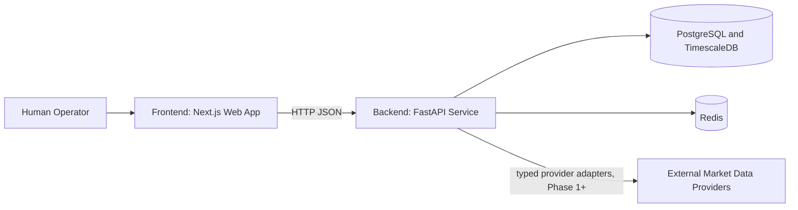
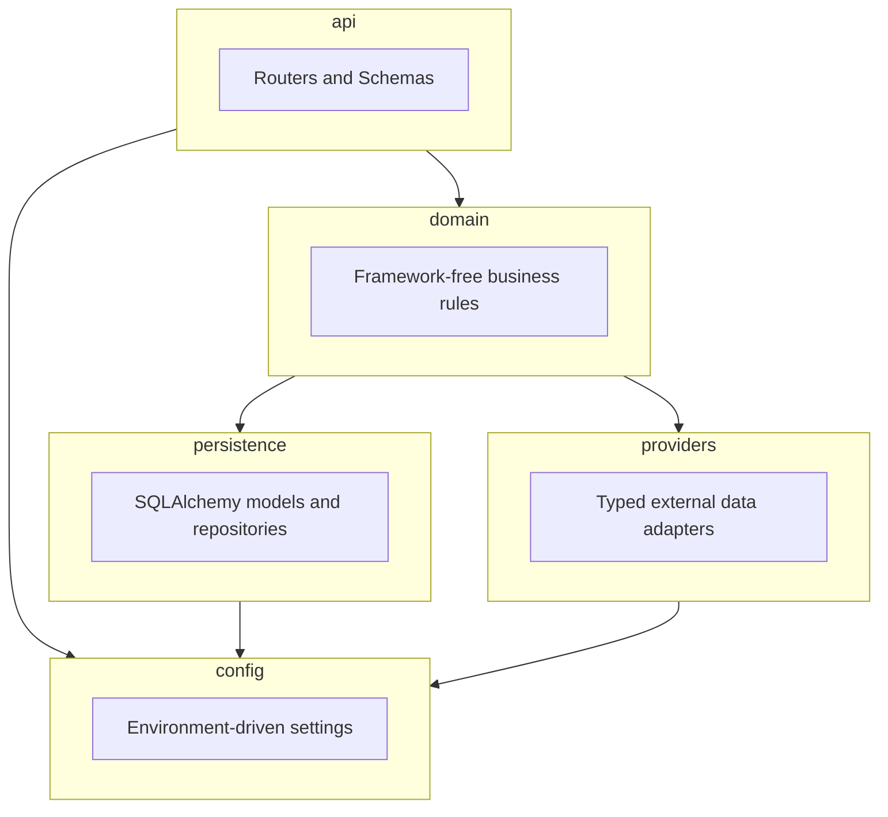

# AEGIS 3.0 Architecture Overview

## Purpose

AEGIS 3.0 is a self-hosted, decision-support platform for market research. It surfaces
transparent, reproducible, point-in-time analysis to a human operator. It never places or
transmits live orders, and it never implies certainty beyond what point-in-time evidence
supports.

This document describes the backend module boundaries established in Phase 0 and populated
starting in Phase 1 (market data ingestion). No scoring, recommendation, prediction, or
trading logic is implemented in either phase; the boundaries below exist so that future
phases can add domain logic without restructuring the codebase.

## System context

As of Phase 1, "External Market Data Providers" has one concrete integration: Alpha Vantage
daily bars (`aegis.providers.alpha_vantage.AlphaVantageProvider`), reached only through the
`POST /market-data/ingest` on-demand endpoint (no background scheduler yet; see
[decisions/0002-phase-1-market-data-ingestion.md](decisions/0002-phase-1-market-data-ingestion.md)).

## Backend module boundaries (`backend/src/aegis/`)

- **`api/`**: FastAPI routers, request/response Pydantic schemas, HTTP-specific error
  mapping. Contains no business logic; delegates to `domain/`.
- **`domain/`**: framework-free business rules and orchestration. Must not import FastAPI,
  SQLAlchemy sessions, or provider SDKs directly; depends on repository/adapter interfaces
  only (`DailyBarRepository` and `DailyBarProvider` are Protocols, satisfied structurally by
  `persistence/` and `providers/` without either importing `domain/`), so it can be tested and
  reasoned about independently of infrastructure. As of Phase 1: an exchange-calendar wrapper,
  daily-bar validation rules, and `MarketDataIngestionService`. Still empty of any
  scoring/recommendation/prediction/trading logic (per project rules, not added before its
  phase and evidence gates are satisfied).
- **`persistence/`**: SQLAlchemy 2.x models, repository classes, and Alembic migrations
  (`backend/alembic/`). Owns all direct database access. Enforces append-only, versioned,
  timestamped, provenance-aware storage for market observations (see
  [data-model.md](data-model.md)). As of Phase 1: `MarketDailyBarObservation` (a TimescaleDB
  hypertable) and `MarketDailyBarRepository`.
- **`providers/`**: typed interfaces (Protocols/ABCs) for external market data sources, plus
  adapter implementations behind those interfaces. Domain code depends on the interface, never
  on a concrete provider SDK, so providers can be swapped or faked in tests. Preserves raw
  provenance for audits. As of Phase 1: `DailyBarProvider` and the first concrete adapter,
  `AlphaVantageProvider`.
- **`config/`**: Pydantic `BaseSettings` reading exclusively from environment variables. No
  secrets, hostnames, or credentials are hardcoded anywhere in the codebase.

## Frontend module boundaries (`frontend/`)

- `app/` (Next.js App Router): pages and layouts. Server components fetch through a typed API
  client; no direct database or provider access from the frontend. No chart, score, or
  recommendation components exist in Phase 0.
- `lib/`: typed HTTP client for the backend API, shared types generated from or matching the
  backend's Pydantic schemas.

## Cross-cutting conventions

- **Time**: all timestamps are stored and reasoned about in UTC internally. Exchange-local
  market-session semantics use explicit exchange calendars (introduced when market-session
  logic is built, not in Phase 0).
- **Validation at the boundary**: invalid, stale, zero, negative, closed-session, or otherwise
  unusable market quotes are rejected in `providers/` (malformed/error responses) or in
  `domain/market_data_validation.py` (per-bar rejection rules), before any derived metric is
  computed or a bar is persisted. See [market-data-contracts.md](market-data-contracts.md).
- **Fail closed**: when data, evidence, validation, calibration, or quality gates are
  incomplete, the system must fail closed rather than produce a misleadingly complete result.
- **Research-only vs actionable**: every stored observation or evidence record carries an
  explicit state flag distinguishing research-only material from actionable material. These
  states are never conflated.

## Deployment topology (Phase 0)

Local development and CI use Docker Compose (`docker-compose.yml`) with four services:
`postgres` (TimescaleDB image), `redis`, `backend`, `frontend`. Each has a health check and a
named persistent volume. See [../operations/local-development.md](../operations/local-development.md)
for exact commands.

Deployment to the UGREEN NAS is out of scope for Phase 0. See
[../../docker/nas/README.md](../../docker/nas/README.md) for the explicit deployment boundary.

## Related documents

- [data-model.md](data-model.md): point-in-time observation model conventions.
- [market-data-contracts.md](market-data-contracts.md): quote validation rules.
- [decisions/0001-phase-0-tooling.md](decisions/0001-phase-0-tooling.md): Phase 0 tooling ADR.
- [decisions/0002-phase-1-market-data-ingestion.md](decisions/0002-phase-1-market-data-ingestion.md):
  Phase 1 market data ingestion ADR.
