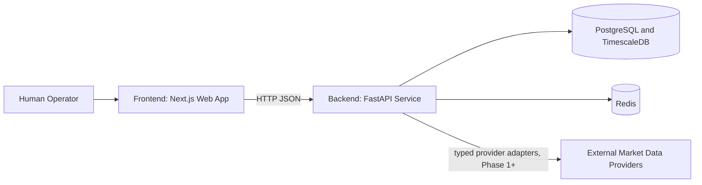
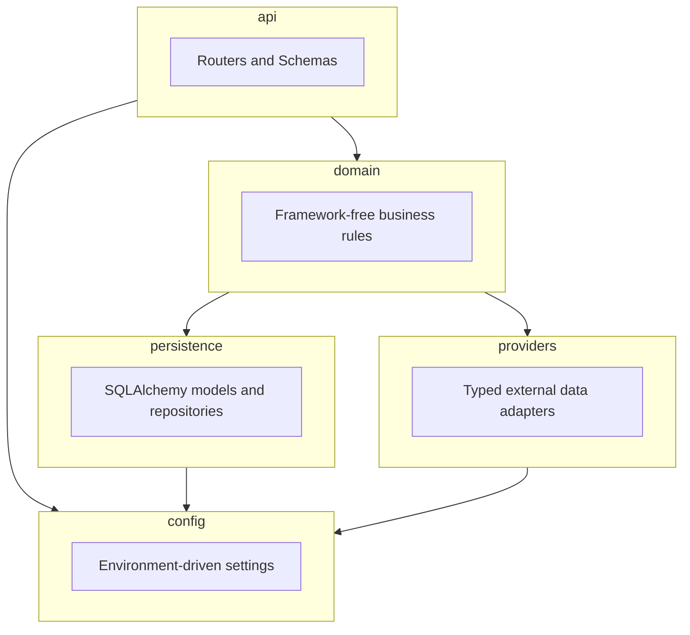

# AEGIS 3.0 Architecture Overview

## Purpose

AEGIS 3.0 is a self-hosted, decision-support platform for market research. It surfaces
transparent, reproducible, point-in-time analysis to a human operator. It never places or
transmits live orders, and it never implies certainty beyond what point-in-time evidence
supports.

This document describes the backend module boundaries established in Phase 0 and populated
starting in Phase 1 (market data ingestion), Phase 2 (scheduled ingestion and a
database-backed watchlist), Phase 3 (operator console over those APIs), Phase 4
(operator session authentication), Phase 5 (daily-bar charts on the operator console),
Phase 6 (research-only assessments over stored daily bars), Phase 7 (UGREEN NAS
deployment packaging), and Phase 8 (automatic research assessments after successful ingest).
Recommendation, prediction, actionable promotion, and trading logic
remain unimplemented; Phase 6 adds only labeled research-only heuristics with fail-closed
gates (see
[decisions/0007-phase-6-research-only-scoring.md](decisions/0007-phase-6-research-only-scoring.md)).
Phase 7 does not expand product capabilities; it packages the existing stack for NAS
deployment (see
[decisions/0008-phase-7-nas-deployment.md](decisions/0008-phase-7-nas-deployment.md)).
Phase 8 reuses Phase 6 method `daily_bar_research_v1` after ingest (see
[decisions/0009-phase-8-scheduled-research.md](decisions/0009-phase-8-scheduled-research.md)).

## System context

As of Phase 1, "External Market Data Providers" includes Alpha Vantage daily bars
(`aegis.providers.alpha_vantage.AlphaVantageProvider`). As of Phase 10, Polygon.io daily
aggregates (`aegis.providers.polygon.PolygonProvider`) are also available; operators choose
primary and optional secondary via `AEGIS_DAILY_BAR_PRIMARY_SOURCE` /
`AEGIS_DAILY_BAR_SECONDARY_SOURCE`, with per-symbol failover on rate-limit and unavailable
errors (ADR-0011). As of Phase 2, ingestion is reached two ways: the
`POST /market-data/ingest` on-demand endpoint, and an in-process APScheduler job
(`aegis.api.scheduler.IngestionScheduler`) that runs on a cron schedule
(`AEGIS_INGESTION_CRON`, default 22:00 UTC on weekdays). Both paths ingest the same
database-backed watchlist (`GET/POST /watchlist`, `DELETE /watchlist/{symbol}`) and run
through the same `MarketDataIngestionService`, so they can never disagree about which symbols
are current or how a bar is validated. A Redis lock ensures only one process runs a scheduled
cycle at a time. As of Phase 4, watchlist and market-data HTTP routes require an operator
session cookie (login via `POST /auth/login`); `/health` and `/ready` stay public. As of
Phase 6, authenticated on-demand research assessment routes under `/research/{symbol}/assessments`
compute and append research-only snapshots from stored primary daily bars. As of Phase 8,
when `AEGIS_RESEARCH_SCHEDULE_AFTER_INGEST_ENABLED` is true, the same method also runs after
each successful locked scheduled ingest (inside the ingest lock) and after successful
on-demand `POST /market-data/ingest` (stored bars only; fail-closed skips log and persist
nothing). See
[decisions/0002-phase-1-market-data-ingestion.md](decisions/0002-phase-1-market-data-ingestion.md),
[decisions/0003-phase-2-scheduled-watchlist.md](decisions/0003-phase-2-scheduled-watchlist.md),
[decisions/0005-phase-4-operator-auth.md](decisions/0005-phase-4-operator-auth.md),
[decisions/0007-phase-6-research-only-scoring.md](decisions/0007-phase-6-research-only-scoring.md),
[decisions/0009-phase-8-scheduled-research.md](decisions/0009-phase-8-scheduled-research.md),
and
[decisions/0011-phase-10-second-market-data-provider.md](decisions/0011-phase-10-second-market-data-provider.md).

## Backend module boundaries (`backend/src/aegis/`)

- **`api/`**: FastAPI routers, request/response Pydantic schemas, HTTP-specific error
  mapping, and infrastructure wiring that legitimately needs a concrete framework (FastAPI
  `Depends`, APScheduler, a live database session). Contains no business logic; delegates to
  `domain/`. As of Phase 2: `scheduler.py` wires the real Redis client, database session, and
  APScheduler into the framework-free `domain.scheduled_ingestion.run_locked_ingestion_cycle`,
  mirroring how `dependencies.py` wires the on-demand ingestion path. As of Phase 8: when
  enabled, the same locked cycle runs `domain.scheduled_research.run_research_after_ingest`
  after ingest succeeds and before lock release; on-demand ingest uses the same helper when
  the flag is set. As of Phase 4: auth
  routes (`/auth/login`, `/auth/logout`, `/auth/me`) and a session dependency that requires a
  valid Redis-backed cookie for `/watchlist*`, `/market-data*`, and `/research*`; `/health`
  and `/ready` stay public for Compose and CI.
- **`domain/`**: framework-free business rules and orchestration. Must not import FastAPI,
  SQLAlchemy sessions, a concrete Redis client, or provider SDKs directly; depends on
  repository/adapter interfaces only (`DailyBarRepository`, `DailyBarProvider`,
  `DistributedLock`, `WatchlistSource`, `IngestionRunner`, Phase 6 research assessment
  reader/store Protocols, and Phase 8 `ResearchAssessor` are satisfied structurally by
  `persistence/`, `providers/`, and `api/scheduler.py` without any of them importing
  `domain/`), so it can be tested and reasoned about independently of infrastructure. As of
  Phase 1: an exchange-calendar wrapper, daily-bar validation rules, and
  `MarketDataIngestionService`. As of Phase 2: watchlist symbol validation (`watchlist.py`)
  and the lock-guarded scheduled-ingestion cycle (`scheduled_ingestion.py`). As of Phase 6:
  `research_assessment.py` implements method `daily_bar_research_v1` (research-only
  components + coverage confidence; never recommendations or actionable promotion). As of
  Phase 8: `scheduled_research.py` orchestrates per-symbol post-ingest assessments
  (fail-closed skips; no new scoring method).
- **`persistence/`**: SQLAlchemy 2.x models, repository classes, and Alembic migrations
  (`backend/alembic/`). Owns all direct database access. Enforces append-only, versioned,
  timestamped, provenance-aware storage for market observations (see
  [data-model.md](data-model.md)). As of Phase 1: `MarketDailyBarObservation` (a TimescaleDB
  hypertable) and `MarketDailyBarRepository`. As of Phase 2: `WatchlistSymbol` and
  `WatchlistRepository` - a plain (non-hypertable), mutable, soft-deletable operational table
  that intentionally does not follow the append-only observation conventions above, because it
  holds current configuration, not a market observation (see ADR-0003). As of Phase 4:
  `Operator` and `OperatorRepository` - another operational table (username + Argon2 hash)
  with seed-once bootstrap from env credentials when empty (see ADR-0005). As of Phase 6:
  `ResearchAssessmentSnapshot` and `ResearchAssessmentRepository` - append-only plain table
  for research-only assessment snapshots (see ADR-0007).
- **`providers/`**: typed interfaces (Protocols/ABCs) for external market data sources, plus
  adapter implementations behind those interfaces. Domain code depends on the interface, never
  on a concrete provider SDK, so providers can be swapped or faked in tests. Preserves raw
  provenance for audits. As of Phase 1: `DailyBarProvider` and `AlphaVantageProvider`. As of
  Phase 10: also `PolygonProvider`, with config-driven primary/secondary selection
  (ADR-0011).
- **`config/`**: Pydantic `BaseSettings` reading exclusively from environment variables. No
  secrets, hostnames, or credentials are hardcoded anywhere in the codebase.

## Frontend module boundaries (`frontend/`)

- `app/` (Next.js App Router): pages and layouts. Server components fetch through a typed API
  client; no direct database or provider access from the frontend. As of Phase 3: `/` is the
  operator console (watchlist + on-demand ingest) and `/symbols/[symbol]` shows a stored
  daily-bar table. As of Phase 4: `/login` collects credentials; protected routes use an SSR
  `requireOperator` gate and redirect on HTTP 401. As of Phase 5: `/symbols/[symbol]` also
  renders a TradingView Lightweight Charts candlestick + volume view above the table, still
  fed only by authenticated `listDailyBars`. As of Phase 6: a `ResearchAssessmentPanel`
  requests and displays research-only API payloads (no client-side research math). As of
  Phase 8: the panel notes that snapshots may also appear after successful ingest when
  configured. No recommendation or trading components exist.
- `components/`: interactive console panels (`WatchlistPanel`, `IngestPanel`,
  `ResearchAssessmentPanel`), presentational tables (`DailyBarsTable`), and chart
  presentation (`DailyBarsChart`). Mutations stay in Client Components; initial reads use
  Server Components where practical.
- `lib/`: typed HTTP client for the backend API, matching the backend's Pydantic schemas
  (health/ready, auth, watchlist, ingest, daily bars, research assessments). Authenticated
  calls use `credentials: "include"` so the httpOnly session cookie is sent cross-origin.

## Cross-cutting conventions

- **Time**: all timestamps are stored and reasoned about in UTC internally. Exchange-local
  market-session semantics use explicit exchange calendars (introduced when market-session
  logic is built, not in Phase 0).
- **Validation at the boundary**: invalid, stale, zero, negative, closed-session, or otherwise
  unusable market quotes are rejected in `providers/` (malformed/error responses) or in
  `domain/market_data_validation.py` (per-bar rejection rules), before any derived metric is
  computed or a bar is persisted. See [market-data-contracts.md](market-data-contracts.md).
- **Fail closed**: when data, evidence, validation, calibration, or quality gates are
  incomplete, the system must fail closed rather than produce a misleadingly complete result.
- **Research-only vs actionable**: every stored observation or evidence record carries an
  explicit state flag distinguishing research-only material from actionable material. These
  states are never conflated.

## Deployment topology

Local development and CI use Docker Compose (`docker-compose.yml`) with four services:
`postgres` (TimescaleDB image), `redis`, `backend`, `frontend`. Each has a health check and a
named persistent volume. See [../operations/local-development.md](../operations/local-development.md)
for exact commands.

UGREEN NAS deployment (Phase 7) uses a Compose **overlay**
(`docker/nas/docker-compose.nas.yml`) on top of the same root file, with all host-specific
values sourced from gitignored `.env.nas`. Package, deploy, and verify are separate scripts;
upload alone is not a verified deployment. Optional Phase 9 TLS packaging
(`docker/nas/docker-compose.nas.tls.yml`, Caddy) terminates HTTPS so Secure session cookies
work on the NAS without changing Phase 4 application auth. See
[../../docker/nas/README.md](../../docker/nas/README.md),
[../operations/nas-deployment.md](../operations/nas-deployment.md),
[decisions/0008-phase-7-nas-deployment.md](decisions/0008-phase-7-nas-deployment.md), and
[decisions/0010-phase-9-nas-tls-reverse-proxy.md](decisions/0010-phase-9-nas-tls-reverse-proxy.md).

## Related documents

- [data-model.md](data-model.md): point-in-time observation model conventions.
- [market-data-contracts.md](market-data-contracts.md): quote validation rules.
- [decisions/0001-phase-0-tooling.md](decisions/0001-phase-0-tooling.md): Phase 0 tooling ADR.
- [decisions/0002-phase-1-market-data-ingestion.md](decisions/0002-phase-1-market-data-ingestion.md):
  Phase 1 market data ingestion ADR.
- [decisions/0003-phase-2-scheduled-watchlist.md](decisions/0003-phase-2-scheduled-watchlist.md):
  Phase 2 scheduled ingestion and database-backed watchlist ADR.
- [decisions/0004-phase-3-operator-console.md](decisions/0004-phase-3-operator-console.md):
  Phase 3 operator console ADR (CORS, table-not-charts, no-auth reaffirmed).
- [decisions/0005-phase-4-operator-auth.md](decisions/0005-phase-4-operator-auth.md):
  Phase 4 operator authentication ADR (httpOnly cookie, Redis sessions, seed-once bootstrap).
- [decisions/0006-phase-5-daily-bar-charts.md](decisions/0006-phase-5-daily-bar-charts.md):
  Phase 5 daily-bar charts ADR (Lightweight Charts, table retained, no backend API changes).
- [decisions/0007-phase-6-research-only-scoring.md](decisions/0007-phase-6-research-only-scoring.md):
  Phase 6 research-only scoring foundations ADR (method `daily_bar_research_v1`, fail-closed,
  coverage vs probability, append-only snapshots).
- [decisions/0008-phase-7-nas-deployment.md](decisions/0008-phase-7-nas-deployment.md):
  Phase 7 UGREEN NAS deployment packaging ADR (Compose overlay, env-sourced config,
  package/deploy/verify, upload ≠ verified).
- [decisions/0009-phase-8-scheduled-research.md](decisions/0009-phase-8-scheduled-research.md):
  Phase 8 post-ingest research assessments ADR (single flag, research inside ingest lock,
  stored bars only, fail-closed skips).
- [decisions/0010-phase-9-nas-tls-reverse-proxy.md](decisions/0010-phase-9-nas-tls-reverse-proxy.md):
  Phase 9 NAS TLS reverse-proxy packaging ADR (optional Caddy overlay, Secure cookies,
  operator PEMs and/or ACME, no proxy Basic Auth).
