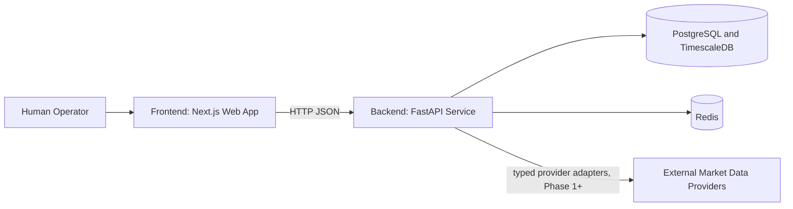
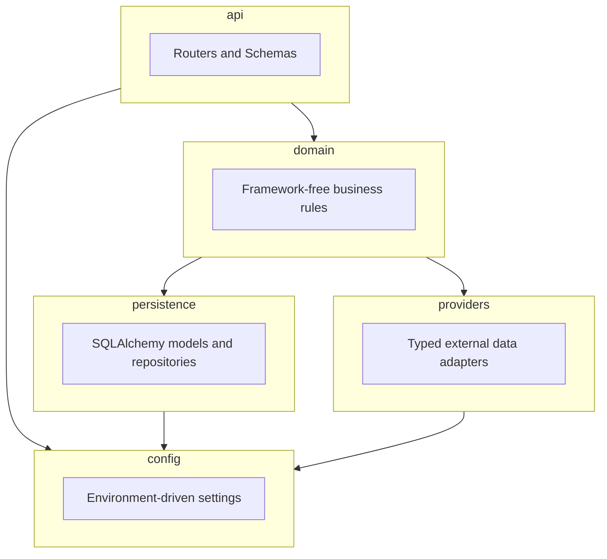

# AEGIS 3.0 Architecture Overview

## Purpose

AEGIS 3.0 is a self-hosted, decision-support platform for market research. It surfaces
transparent, reproducible, point-in-time analysis to a human operator. It never places or
transmits live orders, and it never implies certainty beyond what point-in-time evidence
supports.

This document describes the backend module boundaries established in Phase 0 and populated
starting in Phase 1 (market data ingestion), Phase 2 (scheduled ingestion and a
database-backed watchlist), Phase 3 (operator console over those APIs), Phase 4
(operator session authentication), Phase 5 (daily-bar charts on the operator console),
Phase 6 (research-only assessments over stored daily bars), Phase 7 (UGREEN NAS
deployment packaging), Phase 8 (automatic research assessments after successful ingest),
Phase 10 (second daily-bar provider), and Phase 11 (multi-source coverage weighting),
Phase 12 (provider historical corrections on daily-bar observations), Phase 13 (research
outcome labels), Phase 14 (scheduled outcome labeling after assessments), Phase 15
(research probability calibration v1), Phase 16 (calibration corpus readiness),
Phase 17 (NAS live verification evidence gate), Phase 18 (on-demand calibration),
Phase 19 (calibration history), Phase 20 (outcome label history), Phase 21
(NAS live verify of Phases 18–20), Phase 22 (symbol research evidence summary),
Phase 23 (NAS live verify of Phase 22), Phase 24 (evidence-summary JSON export),
Phase 25 (NAS live verify of Phase 24), Phase 26 (multi-horizon outcome label
surfacing), Phase 27 (NAS live verify of Phase 26), Phase 28 (research assessment
history in the console), Phase 29 (NAS live verify of Phase 28), Phase 30
(outcome label end-date surfacing), Phase 31 (NAS live verify of Phase 30), Phase 32
(calibration readiness JSON export), Phase 33 (NAS live verify of Phase 32), Phase 34
(outcome-label history JSON export), Phase 35 (NAS live verify of Phase 34), Phase 36
(calibration history JSON export), Phase 37 (NAS live verify of Phase 36), Phase 38
(assessment history JSON export), Phase 39 (NAS live verify of Phase 38), Phase 40
(NAS lab TLS cutover), Phase 41 (multi-horizon probability calibration), Phase 42
(NAS live verify of Phase 41), Phase 43 (historical outcome-label backfill), Phase 44
(NAS live verify of Phase 43), Phase 45 (historical research assessment backfill),
Phase 46 (NAS live verify of Phase 45), Phase 47 (label-ready assessment backfill
candidates), Phase 48 (NAS live verify of Phase 47), Phase 49 (prefer unlabeled
label-ready outcome-label backfill), Phase 50 (NAS live verify of Phase 49), and Phase 51
(configurable research bar load limit), Phase 52 (NAS live verify of Phase 51), Phase 53 (full daily-bar history for research
corpus growth), Phase 54 (NAS live verify of Phase 53), Phase 55 (research cross-source
fill + session-depth bar load), Phase 56 (NAS live verify of Phase 55), Phase 57
(source-aware label backfill throughput), Phase 58 (NAS live verify of Phase 57), and
Phase 59 (cross-source provenance in evidence summary), Phase 60 (NAS live verify of
Phase 59), Phase 61 (assessment history component-source filter), Phase 62 (NAS live
verify of Phase 61), Phase 63 (one-click mixed filter from evidence summary), Phase 64
(NAS live verify of Phase 63), Phase 65 (prefer mixed in outcome-label backfill), Phase 66
(NAS live verify of Phase 65), Phase 67 (mixed label coverage on evidence summary), Phase 68
(NAS live verify of Phase 67; live evidence may remain pending SSH), Phase 69 (explicit
mixed labeled count on evidence summary), Phase 70 (NAS live verify of Phases 67–69), Phase 71 (calibration corpus callout on evidence
summary), Phase 72 (NAS live verify of Phase 71 / pending 67–70), Phase 73 (per-horizon
readiness mini-rows on evidence summary), Phase 74 (NAS live verify of Phase 73), Phase 75 (evidence-summary nested by_horizon verify
assertion), Phase 76 (evidence-summary nested corpus/bucket verify assertion), Phase 77
(evidence-summary horizon detail expand), Phase 78 (NAS live verify of Phase 77), Phase 79 (most-recent labeled outcome on evidence
summary), Phase 80 (NAS live verify of Phase 79), Phase 81 (load scan-labeled outcome
labels), Phase 82 (NAS live verify of Phase 81), Phase 83 (outcome-label history assessment
id caption), Phase 84 (NAS live verify of Phase 83), Phase 85 (outcome-label load-kind
caption), and Phase 86 (NAS live verify of Phase 85). Phase 87 (outcome-label download uses
loaded assessment id), Phase 88 (NAS live verify of Phase 87), Phase 89 (download names
assessment id), and Phase 90 (NAS live verify of Phase 89). Phase 91 (outcome-label empty
state for loaded assessment), Phase 92 (NAS live verify of Phase 91), Phase 93 (compute
outcome labels uses loaded assessment id), and Phase 94 (NAS live verify of Phase 93).
Phase 95 (outcome-label backfill refresh uses loaded assessment id) and Phase 96 (NAS live
verify of Phase 95) are drafted.
Recommendation, prediction, actionable promotion, and trading logic
remain unimplemented; Phase 6 adds only labeled research-only heuristics with fail-closed
gates (see
[decisions/0007-phase-6-research-only-scoring.md](decisions/0007-phase-6-research-only-scoring.md)).
Phase 7 does not expand product capabilities; it packages the existing stack for NAS
deployment (see
[decisions/0008-phase-7-nas-deployment.md](decisions/0008-phase-7-nas-deployment.md)).
Phase 8 reuses Phase 6 method `daily_bar_research_v1` after ingest (see
[decisions/0009-phase-8-scheduled-research.md](decisions/0009-phase-8-scheduled-research.md)).
Phase 11 bumps that method to `method_version` 2 for multi-source coverage factors without
blending OHLCV (see
[decisions/0012-phase-11-multi-source-coverage-weighting.md](decisions/0012-phase-11-multi-source-coverage-weighting.md)).
Phase 12 adds append-only provider correction rows and current-bar reads (see
[decisions/0013-phase-12-provider-historical-corrections.md](decisions/0013-phase-12-provider-historical-corrections.md)).
Phase 13 adds append-only forward-return outcome labels (see
[decisions/0014-phase-13-research-outcome-labels.md](decisions/0014-phase-13-research-outcome-labels.md)).
Phase 14 automates outcome labeling after successful assessments when enabled (see
[decisions/0015-phase-14-scheduled-outcome-labels.md](decisions/0015-phase-14-scheduled-outcome-labels.md)).
Phase 15 adds research-only probability calibration from labeled history when enabled (see
[decisions/0016-phase-15-research-probability-calibration.md](decisions/0016-phase-15-research-probability-calibration.md)).
Phase 16 adds read-only calibration corpus readiness diagnostics (see
[decisions/0017-phase-16-calibration-readiness.md](decisions/0017-phase-16-calibration-readiness.md)).
Phase 17 hardens NAS live verification as a distinct evidence gate after package/deploy (see
[decisions/0018-phase-17-nas-live-verification.md](decisions/0018-phase-17-nas-live-verification.md)).
Phase 18 adds on-demand POST/GET calibration routes and operator console compute when
readiness is `ready`, without changing the automatic-calibration default (see
[decisions/0019-phase-18-on-demand-calibration.md](decisions/0019-phase-18-on-demand-calibration.md)).
Phase 19 adds `GET .../calibrations` history (newest first) for audit of append-only rows
(see
[decisions/0020-phase-19-calibration-history.md](decisions/0020-phase-19-calibration-history.md)).
Phase 20 adds the same pattern for outcome labels via `GET .../outcome-labels?limit=` (see
[decisions/0021-phase-20-outcome-label-history.md](decisions/0021-phase-20-outcome-label-history.md)).
Phase 21 redeploys and live-verifies Phases 18–20 on the NAS, including history list checks
(see
[decisions/0022-phase-21-nas-live-verify-phases-18-20.md](decisions/0022-phase-21-nas-live-verify-phases-18-20.md)).
Phase 22 adds `GET /research/{symbol}/evidence-summary` as a read-only aggregate (see
[decisions/0023-phase-22-research-evidence-summary.md](decisions/0023-phase-22-research-evidence-summary.md)).
Phase 23 live-verifies that aggregate on the NAS (see
[decisions/0024-phase-23-nas-live-verify-phase-22.md](decisions/0024-phase-23-nas-live-verify-phase-22.md)).
Phase 24 adds `GET /research/{symbol}/evidence-summary/export` as a downloadable JSON
attachment of the same payload (see
[decisions/0025-phase-24-evidence-summary-export.md](decisions/0025-phase-24-evidence-summary-export.md)).
Phase 25 live-verifies that export on the NAS (see
[decisions/0026-phase-25-nas-live-verify-phase-24.md](decisions/0026-phase-25-nas-live-verify-phase-24.md)).
Phase 26 surfaces all present outcome-label horizon keys in the operator console (see
[decisions/0027-phase-26-multi-horizon-label-surfacing.md](decisions/0027-phase-26-multi-horizon-label-surfacing.md)).
Phase 27 live-verifies that revision on the NAS (see
[decisions/0028-phase-27-nas-live-verify-phase-26.md](decisions/0028-phase-27-nas-live-verify-phase-26.md)).
Phase 28 surfaces newest-first research assessment history in the operator console (see
[decisions/0029-phase-28-assessment-history-console.md](decisions/0029-phase-28-assessment-history-console.md)).
Phase 29 live-verifies that revision on the NAS (see
[decisions/0030-phase-29-nas-live-verify-phase-28.md](decisions/0030-phase-29-nas-live-verify-phase-28.md)).
Phase 30 surfaces present outcome-label end trading dates in the operator console (see
[decisions/0031-phase-30-label-end-date-surfacing.md](decisions/0031-phase-30-label-end-date-surfacing.md)).
Phase 31 live-verifies that revision on the NAS (see
[decisions/0032-phase-31-nas-live-verify-phase-30.md](decisions/0032-phase-31-nas-live-verify-phase-30.md)).
Phase 32 adds `GET /research/{symbol}/calibration-readiness/export` as a downloadable JSON
attachment of readiness diagnostics (see
[decisions/0033-phase-32-calibration-readiness-export.md](decisions/0033-phase-32-calibration-readiness-export.md)).
Phase 33 live-verifies that export on the NAS (see
[decisions/0034-phase-33-nas-live-verify-phase-32.md](decisions/0034-phase-33-nas-live-verify-phase-32.md)).
Phase 34 adds `GET /research/{symbol}/assessments/{id}/outcome-labels/export` as a
downloadable JSON attachment of label history (see
[decisions/0035-phase-34-outcome-labels-export.md](decisions/0035-phase-34-outcome-labels-export.md)).
Phase 35 live-verifies that export on the NAS (see
[decisions/0036-phase-35-nas-live-verify-phase-34.md](decisions/0036-phase-35-nas-live-verify-phase-34.md)).
Phase 36 adds `GET /research/{symbol}/assessments/{id}/calibrations/export` as a
downloadable JSON attachment of calibration history (see
[decisions/0037-phase-36-calibrations-export.md](decisions/0037-phase-36-calibrations-export.md)).
Phase 37 live-verifies that export on the NAS (see
[decisions/0038-phase-37-nas-live-verify-phase-36.md](decisions/0038-phase-37-nas-live-verify-phase-36.md)).
Phase 38 adds `GET /research/{symbol}/assessments/export` as a downloadable JSON
attachment of assessment history (see
[decisions/0039-phase-38-assessments-export.md](decisions/0039-phase-38-assessments-export.md)).
Phase 39 live-verifies that export on the NAS (see
[decisions/0040-phase-39-nas-live-verify-phase-38.md](decisions/0040-phase-39-nas-live-verify-phase-38.md)).
Phase 40 enables the Phase 9 Caddy TLS lab profile on the NAS (see
[decisions/0041-phase-40-nas-lab-tls-cutover.md](decisions/0041-phase-40-nas-lab-tls-cutover.md)
and [../operations/nas-tls-cutover.md](../operations/nas-tls-cutover.md)).
Phase 41 adds horizon-specific probability calibration for `forward_return_5` and
`forward_return_20` (see
[decisions/0042-phase-41-multi-horizon-calibration.md](decisions/0042-phase-41-multi-horizon-calibration.md)).
Phase 42 live-verifies that revision on the NAS under the lab TLS profile (see
[decisions/0043-phase-42-nas-live-verify-phase-41.md](decisions/0043-phase-42-nas-live-verify-phase-41.md)).
Phase 43 adds research-only historical outcome-label backfill over assessment history (see
[decisions/0044-phase-43-outcome-label-backfill.md](decisions/0044-phase-43-outcome-label-backfill.md)).
Phase 44 live-verifies that revision on the NAS under the lab TLS profile (see
[decisions/0045-phase-44-nas-live-verify-phase-43.md](decisions/0045-phase-44-nas-live-verify-phase-43.md)).
Phase 45 adds research-only historical assessment backfill over primary bar dates (see
[decisions/0046-phase-45-assessment-backfill.md](decisions/0046-phase-45-assessment-backfill.md)).
Phase 46 live-verifies that revision on the NAS under the lab TLS profile (see
[decisions/0047-phase-46-nas-live-verify-phase-45.md](decisions/0047-phase-46-nas-live-verify-phase-45.md)).
Phase 47 prefers label-ready as-of dates in assessment backfill (see
[decisions/0048-phase-47-label-ready-assessment-backfill.md](decisions/0048-phase-47-label-ready-assessment-backfill.md)).
Phase 48 live-verifies that revision on the NAS under the lab TLS profile (see
[decisions/0049-phase-48-nas-live-verify-phase-47.md](decisions/0049-phase-48-nas-live-verify-phase-47.md)).
Phase 49 prefers unlabeled label-ready assessments in outcome-label backfill (see
[decisions/0050-phase-49-prefer-unlabeled-label-backfill.md](decisions/0050-phase-49-prefer-unlabeled-label-backfill.md)).
Phase 50 live-verifies that revision on the NAS under the lab TLS profile (see
[decisions/0051-phase-50-nas-live-verify-phase-49.md](decisions/0051-phase-50-nas-live-verify-phase-49.md)).
Phase 51 adds a configurable research bar load limit for assess and backfill paths (see
[decisions/0052-phase-51-research-bar-load-limit.md](decisions/0052-phase-51-research-bar-load-limit.md)).
Phase 52 live-verifies that revision on the NAS under the lab TLS profile (see
[decisions/0053-phase-52-nas-live-verify-phase-51.md](decisions/0053-phase-52-nas-live-verify-phase-51.md)).
Phase 53 defaults daily-bar ingest lookback to `full` for research corpus growth (see
[decisions/0054-phase-53-full-daily-bar-history.md](decisions/0054-phase-53-full-daily-bar-history.md)).
Phase 54 live-verifies that revision on the NAS under the lab TLS profile (see
[decisions/0055-phase-54-nas-live-verify-phase-53.md](decisions/0055-phase-54-nas-live-verify-phase-53.md)).
Phase 55 defaults cross-source component fill on and loads research bars by distinct
trading-date session depth (see
[decisions/0056-phase-55-research-cross-source-session-depth.md](decisions/0056-phase-55-research-cross-source-session-depth.md)).
Phase 56 live-verifies that revision on the NAS under the lab TLS profile (see
[decisions/0057-phase-56-nas-live-verify-phase-55.md](decisions/0057-phase-56-nas-live-verify-phase-55.md)).
Phase 57 matches outcome-label backfill readiness to compute bar sources and raises
scan/default limits (see
[decisions/0058-phase-57-source-aware-label-backfill-throughput.md](decisions/0058-phase-57-source-aware-label-backfill-throughput.md)).
Phase 58 live-verifies that revision on the NAS under the lab TLS profile (see
[decisions/0059-phase-58-nas-live-verify-phase-57.md](decisions/0059-phase-58-nas-live-verify-phase-57.md)).
Phase 59 surfaces cross-source provenance on the research evidence summary (see
[decisions/0060-phase-59-cross-source-provenance-evidence-summary.md](decisions/0060-phase-59-cross-source-provenance-evidence-summary.md)).
Phase 60 live-verifies that revision on the NAS under the lab TLS profile (see
[decisions/0061-phase-60-nas-live-verify-phase-59.md](decisions/0061-phase-60-nas-live-verify-phase-59.md)).
Phase 61 adds optional ``component_source`` filtering on assessment list/export and the
operator console history (see
[decisions/0062-phase-61-assessment-history-component-source-filter.md](decisions/0062-phase-61-assessment-history-component-source-filter.md)).
Phase 62 live-verifies that revision on the NAS under the lab TLS profile (see
[decisions/0063-phase-62-nas-live-verify-phase-61.md](decisions/0063-phase-62-nas-live-verify-phase-61.md)).
Phase 63 adds a one-click mixed filter from the evidence-summary mixed count to assessment
history (see
[decisions/0064-phase-63-one-click-mixed-filter.md](decisions/0064-phase-63-one-click-mixed-filter.md)).
Phase 64 live-verifies that revision on the NAS under the lab TLS profile (see
[decisions/0065-phase-64-nas-live-verify-phase-63.md](decisions/0065-phase-64-nas-live-verify-phase-63.md)).
Phase 65 prefers mixed unlabeled label-ready assessments in outcome-label backfill and
resolves true-mixed label bar sources from as-of provenance (see
[decisions/0066-phase-65-prefer-mixed-label-backfill.md](decisions/0066-phase-65-prefer-mixed-label-backfill.md)).
Phase 66 live-verifies that revision on the NAS under the lab TLS profile (see
[decisions/0067-phase-66-nas-live-verify-phase-65.md](decisions/0067-phase-66-nas-live-verify-phase-65.md)).
Phase 67 surfaces mixed unlabeled count and latest mixed label bar source on the evidence
summary (see
[decisions/0068-phase-67-mixed-label-coverage-evidence-summary.md](decisions/0068-phase-67-mixed-label-coverage-evidence-summary.md)).
Phase 68 live-verifies that revision on the NAS under the lab TLS profile (see
[decisions/0069-phase-68-nas-live-verify-phase-67.md](decisions/0069-phase-68-nas-live-verify-phase-67.md)).
Phase 69 adds an explicit mixed labeled count and console “N of M mixed” display (see
[decisions/0070-phase-69-mixed-labeled-count-evidence-summary.md](decisions/0070-phase-69-mixed-labeled-count-evidence-summary.md)).
Phase 70 live-verifies Phases 67–69 on the NAS under the lab TLS profile once SSH is
available (see
[decisions/0071-phase-70-nas-live-verify-phases-67-69.md](decisions/0071-phase-70-nas-live-verify-phases-67-69.md)).
Phase 71 surfaces calibration corpus and bucket counts from nested readiness on the
evidence summary console (see
[decisions/0072-phase-71-calibration-corpus-callout-evidence-summary.md](decisions/0072-phase-71-calibration-corpus-callout-evidence-summary.md)).
Phase 72 live-verifies Phase 71 (and pending 67–70) on the NAS once SSH is available (see
[decisions/0073-phase-72-nas-live-verify-phase-71.md](decisions/0073-phase-72-nas-live-verify-phase-71.md)).
Phase 73 surfaces per-horizon readiness mini-rows from nested ``by_horizon`` on the evidence
summary (see
[decisions/0074-phase-73-per-horizon-readiness-evidence-summary.md](decisions/0074-phase-73-per-horizon-readiness-evidence-summary.md)).
Phase 74 live-verifies that revision on the NAS under the lab TLS profile (see
[decisions/0075-phase-74-nas-live-verify-phase-73.md](decisions/0075-phase-74-nas-live-verify-phase-73.md)).
Phase 75 asserts nested evidence-summary ``calibration_readiness.by_horizon`` keys in live
verify scripts (see
[decisions/0076-phase-75-evidence-summary-by-horizon-verify.md](decisions/0076-phase-75-evidence-summary-by-horizon-verify.md)).
Phase 76 asserts nested evidence-summary corpus/bucket readiness fields in live verify
scripts (see
[decisions/0077-phase-76-evidence-summary-corpus-bucket-verify.md](decisions/0077-phase-76-evidence-summary-corpus-bucket-verify.md)).
Phase 77 expands evidence-summary horizon mini-rows to show nested ``by_horizon.detail``
(see
[decisions/0078-phase-77-horizon-detail-expand.md](decisions/0078-phase-77-horizon-detail-expand.md)).
Phase 78 live-verifies that revision on the NAS under the lab TLS profile (see
[decisions/0079-phase-78-nas-live-verify-phase-77.md](decisions/0079-phase-78-nas-live-verify-phase-77.md)).
Phase 79 surfaces the most recent labeled outcome in the ≤100 scan when the absolute latest
assessment is still unlabeled (see
[decisions/0080-phase-79-most-recent-labeled-evidence-summary.md](decisions/0080-phase-79-most-recent-labeled-evidence-summary.md)).
Phase 80 live-verifies that revision on the NAS under the lab TLS profile (see
[decisions/0081-phase-80-nas-live-verify-phase-79.md](decisions/0081-phase-80-nas-live-verify-phase-79.md)).
Phase 81 adds one-click load of outcome labels for the scan-labeled assessment id (see
[decisions/0082-phase-81-load-scan-labeled-labels.md](decisions/0082-phase-81-load-scan-labeled-labels.md)).
Phase 82 live-verifies that revision on the NAS under the lab TLS profile (see
[decisions/0083-phase-82-nas-live-verify-phase-81.md](decisions/0083-phase-82-nas-live-verify-phase-81.md)).
Phase 83 captions the outcome-label panel with the assessment id it was loaded for (see
[decisions/0084-phase-83-outcome-label-history-assessment-id.md](decisions/0084-phase-83-outcome-label-history-assessment-id.md)).
Phase 84 live-verifies that revision on the NAS under the lab TLS profile (see
[decisions/0085-phase-84-nas-live-verify-phase-83.md](decisions/0085-phase-84-nas-live-verify-phase-83.md)).
Phase 85 captions whether labels were loaded from latest or scan-labeled (see
[decisions/0086-phase-85-outcome-label-load-kind-caption.md](decisions/0086-phase-85-outcome-label-load-kind-caption.md)).
Phase 86 live-verifies that revision on the NAS under the lab TLS profile (see
[decisions/0087-phase-86-nas-live-verify-phase-85.md](decisions/0087-phase-86-nas-live-verify-phase-85.md)).
Phase 87 binds outcome-label JSON download to the loaded assessment id (see
[decisions/0088-phase-87-outcome-label-download-loaded-assessment.md](decisions/0088-phase-87-outcome-label-download-loaded-assessment.md)).
Phase 88 live-verifies that revision on the NAS under the lab TLS profile (see
[decisions/0089-phase-88-nas-live-verify-phase-87.md](decisions/0089-phase-88-nas-live-verify-phase-87.md)).
Phase 89 names the download target assessment id on the export control (see
[decisions/0090-phase-89-outcome-label-download-names-assessment.md](decisions/0090-phase-89-outcome-label-download-names-assessment.md)).
Phase 90 live-verifies that revision on the NAS under the lab TLS profile (see
[decisions/0091-phase-90-nas-live-verify-phase-89.md](decisions/0091-phase-90-nas-live-verify-phase-89.md)).
Phase 91 keeps the outcome-label panel visible with an empty-state when a loaded assessment
has no labels (see
[decisions/0092-phase-91-outcome-label-empty-state-loaded-assessment.md](decisions/0092-phase-91-outcome-label-empty-state-loaded-assessment.md)).
Phase 92 live-verifies that revision on the NAS under the lab TLS profile (see
[decisions/0093-phase-92-nas-live-verify-phase-91.md](decisions/0093-phase-92-nas-live-verify-phase-91.md)).
Phase 93 binds compute outcome labels to the loaded assessment id (see
[decisions/0094-phase-93-compute-outcome-labels-loaded-assessment.md](decisions/0094-phase-93-compute-outcome-labels-loaded-assessment.md)).
Phase 94 live-verifies that revision on the NAS under the lab TLS profile (see
[decisions/0095-phase-94-nas-live-verify-phase-93.md](decisions/0095-phase-94-nas-live-verify-phase-93.md)).
Phase 95 refreshes outcome-label history for the loaded assessment after backfill (see
[decisions/0096-phase-95-outcome-label-backfill-refresh-loaded-assessment.md](decisions/0096-phase-95-outcome-label-backfill-refresh-loaded-assessment.md)).
Phase 96 live-verifies that revision on the NAS under the lab TLS profile (see
[decisions/0097-phase-96-nas-live-verify-phase-95.md](decisions/0097-phase-96-nas-live-verify-phase-95.md)).

## System context

As of Phase 1, "External Market Data Providers" includes Alpha Vantage daily bars
(`aegis.providers.alpha_vantage.AlphaVantageProvider`). As of Phase 10, Polygon.io daily
aggregates (`aegis.providers.polygon.PolygonProvider`) are also available; operators choose
primary and optional secondary via `AEGIS_DAILY_BAR_PRIMARY_SOURCE` /
`AEGIS_DAILY_BAR_SECONDARY_SOURCE`, with per-symbol failover on rate-limit and unavailable
errors (ADR-0011). As of Phase 2, ingestion is reached two ways: the
`POST /market-data/ingest` on-demand endpoint, and an in-process APScheduler job
(`aegis.api.scheduler.IngestionScheduler`) that runs on a cron schedule
(`AEGIS_INGESTION_CRON`, default 22:00 UTC on weekdays). Both paths ingest the same
database-backed watchlist (`GET/POST /watchlist`, `DELETE /watchlist/{symbol}`) and run
through the same `MarketDataIngestionService`, so they can never disagree about which symbols
are current or how a bar is validated. A Redis lock ensures only one process runs a scheduled
cycle at a time. As of Phase 4, watchlist and market-data HTTP routes require an operator
session cookie (login via `POST /auth/login`); `/health` and `/ready` stay public. As of
Phase 6, authenticated on-demand research assessment routes under `/research/{symbol}/assessments`
compute and append research-only snapshots from stored primary daily bars. As of Phase 8,
when `AEGIS_RESEARCH_SCHEDULE_AFTER_INGEST_ENABLED` is true, the same method also runs after
each successful locked scheduled ingest (inside the ingest lock) and after successful
on-demand `POST /market-data/ingest` (stored bars only; fail-closed skips log and persist
nothing). As of Phase 14, when `AEGIS_RESEARCH_OUTCOME_LABEL_AFTER_ASSESSMENT_ENABLED` is
true, successful assessments from those paths also attempt Phase 13 outcome labels inside the
same scheduled ingest lock (ADR-0015). As of Phase 15, when
`AEGIS_RESEARCH_CALIBRATION_AFTER_LABEL_ENABLED` is true, successful assessments also attempt
empirical probability calibration from labeled history (ADR-0016). As of Phase 16,
`GET /research/{symbol}/calibration-readiness` reports corpus-gate readiness without
persisting rows (ADR-0017). As of Phase 18, authenticated
`POST/GET /research/{symbol}/assessments/{id}/calibrations` persist or fetch on-demand
`research_calibration_v1` rows without requiring the automatic flag (ADR-0019). As of
Phase 19, `GET .../calibrations?limit=` lists append-only history newest first (ADR-0020).
As of Phase 20, `GET .../outcome-labels?limit=` lists append-only label history (ADR-0021).
As of Phase 22, `GET /research/{symbol}/evidence-summary` aggregates research-only evidence
for one symbol (ADR-0023). As of Phase 24,
`GET /research/{symbol}/evidence-summary/export` downloads that aggregate as a JSON
attachment (ADR-0025). As of Phase 11, when `AEGIS_RESEARCH_MULTI_SOURCE_COVERAGE_ENABLED` is true,
assessments use `method_version` 2 multi-source coverage weighting (ADR-0012). See
[decisions/0002-phase-1-market-data-ingestion.md](decisions/0002-phase-1-market-data-ingestion.md),
[decisions/0003-phase-2-scheduled-watchlist.md](decisions/0003-phase-2-scheduled-watchlist.md),
[decisions/0005-phase-4-operator-auth.md](decisions/0005-phase-4-operator-auth.md),
[decisions/0007-phase-6-research-only-scoring.md](decisions/0007-phase-6-research-only-scoring.md),
[decisions/0009-phase-8-scheduled-research.md](decisions/0009-phase-8-scheduled-research.md),
[decisions/0011-phase-10-second-market-data-provider.md](decisions/0011-phase-10-second-market-data-provider.md),
and
[decisions/0012-phase-11-multi-source-coverage-weighting.md](decisions/0012-phase-11-multi-source-coverage-weighting.md).

## Backend module boundaries (`backend/src/aegis/`)

- **`api/`**: FastAPI routers, request/response Pydantic schemas, HTTP-specific error
  mapping, and infrastructure wiring that legitimately needs a concrete framework (FastAPI
  `Depends`, APScheduler, a live database session). Contains no business logic; delegates to
  `domain/`. As of Phase 2: `scheduler.py` wires the real Redis client, database session, and
  APScheduler into the framework-free `domain.scheduled_ingestion.run_locked_ingestion_cycle`,
  mirroring how `dependencies.py` wires the on-demand ingestion path. As of Phase 8: when
  enabled, the same locked cycle runs `domain.scheduled_research.run_research_after_ingest`
  after ingest succeeds and before lock release; on-demand ingest uses the same helper when
  the flag is set. As of Phase 4: auth
  routes (`/auth/login`, `/auth/logout`, `/auth/me`) and a session dependency that requires a
  valid Redis-backed cookie for `/watchlist*`, `/market-data*`, and `/research*`; `/health`
  and `/ready` stay public for Compose and CI.
- **`domain/`**: framework-free business rules and orchestration. Must not import FastAPI,
  SQLAlchemy sessions, a concrete Redis client, or provider SDKs directly; depends on
  repository/adapter interfaces only (`DailyBarRepository`, `DailyBarProvider`,
  `DistributedLock`, `WatchlistSource`, `IngestionRunner`, Phase 6 research assessment
  reader/store Protocols, and Phase 8 `ResearchAssessor` are satisfied structurally by
  `persistence/`, `providers/`, and `api/scheduler.py` without any of them importing
  `domain/`), so it can be tested and reasoned about independently of infrastructure. As of
  Phase 1: an exchange-calendar wrapper, daily-bar validation rules, and
  `MarketDataIngestionService`. As of Phase 2: watchlist symbol validation (`watchlist.py`)
  and the lock-guarded scheduled-ingestion cycle (`scheduled_ingestion.py`). As of Phase 6:
  `research_assessment.py` implements method `daily_bar_research_v1` (research-only
  components + coverage confidence; never recommendations or actionable promotion). As of
  Phase 8: `scheduled_research.py` orchestrates per-symbol post-ingest assessments
  (fail-closed skips; no new scoring method). As of Phase 11: the same method gains
  `method_version` 2 multi-source availability/agreement coverage factors (ADR-0012;
  preferred-source components; no OHLCV blend).
- **`persistence/`**: SQLAlchemy 2.x models, repository classes, and Alembic migrations
  (`backend/alembic/`). Owns all direct database access. Enforces append-only, versioned,
  timestamped, provenance-aware storage for market observations (see
  [data-model.md](data-model.md)). As of Phase 1: `MarketDailyBarObservation` (a TimescaleDB
  hypertable) and `MarketDailyBarRepository`. As of Phase 2: `WatchlistSymbol` and
  `WatchlistRepository` - a plain (non-hypertable), mutable, soft-deletable operational table
  that intentionally does not follow the append-only observation conventions above, because it
  holds current configuration, not a market observation (see ADR-0003). As of Phase 4:
  `Operator` and `OperatorRepository` - another operational table (username + Argon2 hash)
  with seed-once bootstrap from env credentials when empty (see ADR-0005). As of Phase 6:
  `ResearchAssessmentSnapshot` and `ResearchAssessmentRepository` - append-only plain table
  for research-only assessment snapshots (see ADR-0007).
- **`providers/`**: typed interfaces (Protocols/ABCs) for external market data sources, plus
  adapter implementations behind those interfaces. Domain code depends on the interface, never
  on a concrete provider SDK, so providers can be swapped or faked in tests. Preserves raw
  provenance for audits. As of Phase 1: `DailyBarProvider` and `AlphaVantageProvider`. As of
  Phase 10: also `PolygonProvider`, with config-driven primary/secondary selection
  (ADR-0011).
- **`config/`**: Pydantic `BaseSettings` reading exclusively from environment variables. No
  secrets, hostnames, or credentials are hardcoded anywhere in the codebase.

## Frontend module boundaries (`frontend/`)

- `app/` (Next.js App Router): pages and layouts. Server components fetch through a typed API
  client; no direct database or provider access from the frontend. As of Phase 3: `/` is the
  operator console (watchlist + on-demand ingest) and `/symbols/[symbol]` shows a stored
  daily-bar table. As of Phase 4: `/login` collects credentials; protected routes use an SSR
  `requireOperator` gate and redirect on HTTP 401. As of Phase 5: `/symbols/[symbol]` also
  renders a TradingView Lightweight Charts candlestick + volume view above the table, still
  fed only by authenticated `listDailyBars`. As of Phase 6: a `ResearchAssessmentPanel`
  requests and displays research-only API payloads (no client-side research math). As of
  Phase 8: the panel notes that snapshots may also appear after successful ingest when
  configured. As of Phase 11: the panel surfaces multi-source coverage factor fields when
  present in the API payload (presentation only). No recommendation or trading components
  exist.
- `components/`: interactive console panels (`WatchlistPanel`, `IngestPanel`,
  `ResearchAssessmentPanel`), presentational tables (`DailyBarsTable`), and chart
  presentation (`DailyBarsChart`). Mutations stay in Client Components; initial reads use
  Server Components where practical.
- `lib/`: typed HTTP client for the backend API, matching the backend's Pydantic schemas
  (health/ready, auth, watchlist, ingest, daily bars, research assessments). Authenticated
  calls use `credentials: "include"` so the httpOnly session cookie is sent cross-origin.

## Cross-cutting conventions

- **Time**: all timestamps are stored and reasoned about in UTC internally. Exchange-local
  market-session semantics use explicit exchange calendars (introduced when market-session
  logic is built, not in Phase 0).
- **Validation at the boundary**: invalid, stale, zero, negative, closed-session, or otherwise
  unusable market quotes are rejected in `providers/` (malformed/error responses) or in
  `domain/market_data_validation.py` (per-bar rejection rules), before any derived metric is
  computed or a bar is persisted. See [market-data-contracts.md](market-data-contracts.md).
- **Fail closed**: when data, evidence, validation, calibration, or quality gates are
  incomplete, the system must fail closed rather than produce a misleadingly complete result.
- **Research-only vs actionable**: every stored observation or evidence record carries an
  explicit state flag distinguishing research-only material from actionable material. These
  states are never conflated.

## Deployment topology

Local development and CI use Docker Compose (`docker-compose.yml`) with four services:
`postgres` (TimescaleDB image), `redis`, `backend`, `frontend`. Each has a health check and a
named persistent volume. See [../operations/local-development.md](../operations/local-development.md)
for exact commands.

UGREEN NAS deployment (Phase 7) uses a Compose **overlay**
(`docker/nas/docker-compose.nas.yml`) on top of the same root file, with all host-specific
values sourced from gitignored `.env.nas`. Package, deploy, and verify are separate scripts;
upload alone is not a verified deployment. Optional Phase 9 TLS packaging
(`docker/nas/docker-compose.nas.tls.yml`, Caddy) terminates HTTPS so Secure session cookies
work on the NAS without changing Phase 4 application auth. See
[../../docker/nas/README.md](../../docker/nas/README.md),
[../operations/nas-deployment.md](../operations/nas-deployment.md),
[decisions/0008-phase-7-nas-deployment.md](decisions/0008-phase-7-nas-deployment.md), and
[decisions/0010-phase-9-nas-tls-reverse-proxy.md](decisions/0010-phase-9-nas-tls-reverse-proxy.md).

## Related documents

- [data-model.md](data-model.md): point-in-time observation model conventions.
- [market-data-contracts.md](market-data-contracts.md): quote validation rules.
- [decisions/0001-phase-0-tooling.md](decisions/0001-phase-0-tooling.md): Phase 0 tooling ADR.
- [decisions/0002-phase-1-market-data-ingestion.md](decisions/0002-phase-1-market-data-ingestion.md):
  Phase 1 market data ingestion ADR.
- [decisions/0003-phase-2-scheduled-watchlist.md](decisions/0003-phase-2-scheduled-watchlist.md):
  Phase 2 scheduled ingestion and database-backed watchlist ADR.
- [decisions/0004-phase-3-operator-console.md](decisions/0004-phase-3-operator-console.md):
  Phase 3 operator console ADR (CORS, table-not-charts, no-auth reaffirmed).
- [decisions/0005-phase-4-operator-auth.md](decisions/0005-phase-4-operator-auth.md):
  Phase 4 operator authentication ADR (httpOnly cookie, Redis sessions, seed-once bootstrap).
- [decisions/0006-phase-5-daily-bar-charts.md](decisions/0006-phase-5-daily-bar-charts.md):
  Phase 5 daily-bar charts ADR (Lightweight Charts, table retained, no backend API changes).
- [decisions/0007-phase-6-research-only-scoring.md](decisions/0007-phase-6-research-only-scoring.md):
  Phase 6 research-only scoring foundations ADR (method `daily_bar_research_v1`, fail-closed,
  coverage vs probability, append-only snapshots).
- [decisions/0008-phase-7-nas-deployment.md](decisions/0008-phase-7-nas-deployment.md):
  Phase 7 UGREEN NAS deployment packaging ADR (Compose overlay, env-sourced config,
  package/deploy/verify, upload ≠ verified).
- [decisions/0009-phase-8-scheduled-research.md](decisions/0009-phase-8-scheduled-research.md):
  Phase 8 post-ingest research assessments ADR (single flag, research inside ingest lock,
  stored bars only, fail-closed skips).
- [decisions/0010-phase-9-nas-tls-reverse-proxy.md](decisions/0010-phase-9-nas-tls-reverse-proxy.md):
  Phase 9 NAS TLS reverse-proxy packaging ADR (optional Caddy overlay, Secure cookies,
  operator PEMs and/or ACME, no proxy Basic Auth).
- [decisions/0011-phase-10-second-market-data-provider.md](decisions/0011-phase-10-second-market-data-provider.md):
  Phase 10 second daily-bar provider ADR (Polygon + primary/failover).
- [decisions/0012-phase-11-multi-source-coverage-weighting.md](decisions/0012-phase-11-multi-source-coverage-weighting.md):
  Phase 11 multi-source coverage weighting ADR (research-only; no blended bars).
- [decisions/0013-phase-12-provider-historical-corrections.md](decisions/0013-phase-12-provider-historical-corrections.md):
  Phase 12 provider historical corrections ADR (append-only correction rows; current-bar reads).
